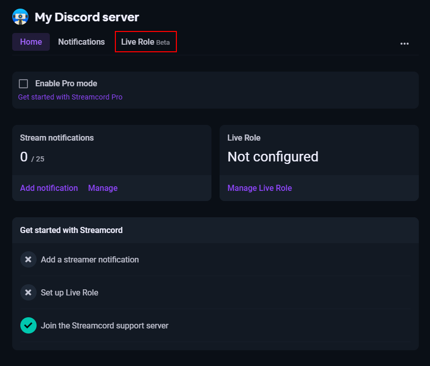

# Set up Live Role

## Get your server ready

**1.** Create a role to be added to members when they go live.\
For example, you could call it "Now Live" or "Streaming on Twitch".

.png>)

**2.** Drag the Streamcord role to the top of your server's role list.\
If you don't want it to be at the very top, drag it above your live role.

**3.** Give Streamcord the _Manage Roles_ permission.

.png>)

**4.** Click "Save changes".

## Set up your live role through the dashboard

**1.** Go to [https://dash.streamcord.io/](https://dash.streamcord.io/) in your browser.

**2.** Log in with Discord.

**3.** Choose your server from the list.

**4.** Select the "Live Role" tab.

**5.** Click the "Add a Live Role" button.

**6.** Under the "Live role" dropdown, select the role that we created earlier.

.png>)


You may notice that some roles are not able to be selected. Roles that meet any of the following conditions are not eligible to be your server's live role:

* The server's default role (@everyone)
* The server's Nitro Booster role
* The role is managed by a bot or integration


**7.** (Optional) Choose a [filter role](intro.md#filter-roles) under the "Filter role" dropdown and set up [Live Role Notifications](live-role-notifications/).

**8.** Click "Save changes" on the floating bar at the bottom of the screen.

.png>)

Note that it may take some time for Streamcord to update roles for some members. If you set up Live Role while someone is actively streaming, the role will not be added until they start another stream.
