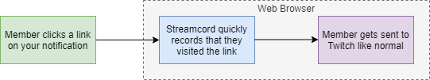

# Click Analytics


**This feature is currently in alpha.** It is highly experimental and is not fully implemented. When using Click Analytics, notifications will still send as normal and Streamcord will track analytics, but there is currently no way to view the analytics.



This feature is part of [Streamcord Pro](https://streamcord.io/twitch/pro).


Click Analytics lets you view how well your Streamcord notifications are performing. You can see overall stats like how many people clicked on a certain notification message to watch your stream, as well as more detailed information, like what part of the world your server members are from.

Click Analytics is only available for [Spyglass](./) notifications.

## How does Click Analytics work?

Click Analytics works by changing the URLs in your notification's messages from Twitch to one that point's to Streamcord's servers. From there, we'll record basic information about where the visitor is located, and instantly send them to Twitch so they can view your stream. The process is seamless and most people won't even notice.

### Limitations

In order for click analytics to work, you must use the `{user.twitch_url}` variable if you want to provide a link to your stream. Do not manually type the URL (e.g. `https://twitch.tv/myusername`) because if someone clicks that link, you won't be able to track it.

This is because we can only track traffic that comes to our own servers. Therefore, the link that shows up in your notification message will look slightly different. For example, a link to Monstercat's stream might look like [`https://streamcord.tv/link/monstercat/Ym9KVjUg`](https://streamcord.tv/link/monstercat/Ym9KVjUg). However, as mentioned above, anyone who clicks on the link will be redirected to the relevant Twitch page instantly.

.png>)

## How to enable Click Analytics

### For a new notification

To enable Click Analytics on a new notification, follow the same directions on how to [add a Spyglass notification](add-spyglass.md). After you click the "Use Spyglass" checkbox, another checkbox titled "Track click analytics" will appear. Check that box and finish creating the notification.

 (1).png>)

### ~~For an existing notification~~

~~To enable Click Notifications for an existing Spyglass notification, check the box titled "Track click analytics" and save your changes.~~


**Enabling Click Analytics for an existing notification is not supported at the moment.**&#x20;

If you would like to enable Click Analytics for an existing notification, you will need to delete the existing notification and then re-create it while toggling the "Use Spyglass" checkbox and the "Track click analytics" checkbox.


## How to view analytics for your notifications

Because this feature is in beta and I only wrote this page for the staff team (yay you for finding a new feature early!), there is currently no way to view analytics. In the future, this will obviously be changed, and you'll be able to view them through the dashboard.

## Privacy info

Click Analytics only records coarse location information (down to the "region" level on Cloudflare). No data is tied to your Discord or Twitch account, and we do not record IP addresses, making it **completely anonymous**. Moreover, data for individual clicks are only kept for 30 days, and the total number of clicks a link receives is kept indefinitely.

The backend for Click Analytics is open-source on GitHub: [https://github.com/streamcord/analytics](https://github.com/streamcord/analytics)

All data is handled in accordance with Streamcord's [Privacy Policy](https://streamcord.io/twitch/privacy).
