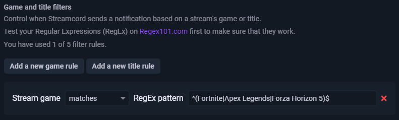

# Game and Title Filters

Game & Title Filters allow you to choose when Streamcord sends a notification based on the stream's title or game that is currently being played.



## How filters work


**Filters only work for** [**Spyglass**](./) **notifications.** If you're still using [Legacy](../legacy/) notifications in your server, please [transfer them to Spyglass](transfer-notifications-to-spyglass.md).


### Limits

Game and Title Filters only work for Spyglass notifications. They do not work for [Legacy](../legacy/) or [Live Role](../../live-role/live-role-notifications/) Notifications.

Additionally, there are limits on how many and which rules may be applied to notifications, depending on your Streamcord Pro subscription:

| Feature                   | Streamcord Free | Streamcord Pro |
| ------------------------- | :-------------: | :------------: |
| Game filter rules         |        ✔️       |       ✔️       |
| Stream title filter rules |        ❌        |       ✔️       |
| Rules per notification    |     Up to 1     |     Up to 5    |

### Regular Expressions (RegEx)

This feature makes use of [Regular Expressions](https://en.wikipedia.org/wiki/Regular\_expression), abbreviated as RegEx, to allow for flexibility and extensive customization in filter rules. Regular Expressions are sequences of characters that computers use to detect and find patterns in text.&#x20;

Here's an example of a Regular Expression:

<figure><figcaption><p>A Regular Expression that matches every capital letter, and every letter that follows it.</p></figcaption></figure>

Chances are, you won't need something that complicated. The main things to remember are:

* Some characters have more than one meaning, such as `.`, `+`, `*`, `?`, `^`, `$`, `(`, `)`, `[`, `]`, `{`, `}`, `|`, and `\`. To prevent unintended behavior, you need to "escape" them by preceding each special character with a backslash (`\`).
* The OR operator, `|`, allows you to tell Streamcord to search for different groups of characters. This is useful if you want the bot to notify for multiple games or keywords in a stream title.
* Streamcord will search for a _partial match_ of your pattern, meaning that if you set your rule to `Destiny`, you will be notified for any game that contains the word "Destiny", such as "Destiny 2" and "With Your Destiny".
* **Filter rules are case sensitive.** To tell Streamcord to ignore the capitalization of letters, start your pattern with `` ` `` and end it with `` `i ``.


While Regular Expressions are powerful, they can also be very difficult and awkward to use. If you're unfamiliar with them, we recommend checking out a [tutorial on RegEx](https://www.sitepoint.com/learn-regex/) first.


Check [How to design your filter rules](game-and-title-filters.md#how-to-design-your-filter-rules) for examples on how to create RegEx rules.


Please note that Streamcord support staff will not create Regular Expression patterns for you. While we will do our best to assist everyone, we simply do not have enough time to teach everyone how to use RegEx. Check below for common scenarios and their patterns.


## How to design your filter rules

This section contains information on how to create your notification filter rules for a few common scenarios.

### Notify for only one game

Let's say you only want Streamcord to send a notification when a streamer is playing Fortnite. In your notification settings, add a new game rule, make sure the mode equals "matches" and set the pattern to `^Fortnite$`. The `^` locks the sequence "Fortnite" to the beginning of the game's name, and the `$` locks it to the end, meaning that the entire game's name must equal the word "Fortnite".

<figure><figcaption><p>Example of a filter rule for one game.</p></figcaption></figure>

### Notify for multiple games

Follow the same instructions as above, but split each game name with the `|` character, and surround your list of game names with parenthesis. For example, if you want to notify for Fortnite, Apex Legends, and Forza Horizon 5, your pattern should look like this:

```regex
^(Fortnite|Apex Legends|Forza Horizon 5)$
```

<figure><figcaption><p>Example of a filter rule for multiple games.</p></figcaption></figure>

### Notify for all games except certain ones

Follow the same instructions as one of the above two scenarios, and change the rule's match type to "does not match".&#x20;

<figure><figcaption><p>Example of a filter rule for all games except one.</p></figcaption></figure>

### Notify for a game and keyword in title

For example, let's say that you only want to be notified when a certain Fortnite streamer is playing cash cups. We'll add a game filter rule for Fortnite as described in the sections above, then click "add a new title rule". Under the pattern for the rule, we'll enter "cash cups", along with the flag for case-insensitivity, marked with a leading backtick, and a trailing backtick and the letter "i". Here's what our final pattern looks like:

```regex
`cash cups`i
```

Using this pattern will match any version of the string "cash cups" regardless of capitalization, including these variations, and anything in between:

* Cash Cups
* cAsH cUpS
* CASH CUPS
* cash cups

Lastly, we'll change the filter mode at the bottom to "And (require all rules to be met)". This makes sure that we only receive a notification if the streamer is playing Fortnite and has "cash cups" in their stream title. Leaving it as the default option would only require one of those conditions to be met.

<figure><figcaption><p>Example of a filter rule for a certain game and title keyword.</p></figcaption></figure>

## How to add a filter

1. Head to your server's page on the [Streamcord Dashboard](https://dash.streamcord.io).
2. Create a new [Spyglass](./) notification, or edit an existing one.
3. Under "Show advanced options", scroll to "Game and title filters".
4. Click "Add a new game rule" to add a filter rule based on the stream's game, or click "Add a new title rule" to add a filter rule based on the stream's title.
5. If you have multiple filter rules, choose a Filter mode from the list.
6. Save your changes.

