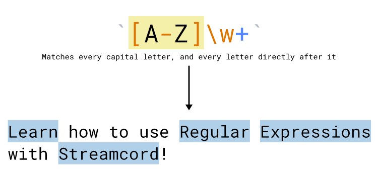

# Title & Game Filters


**This documentation page is currently under construction.**



**Title & Game Filters are currently in closed beta for** [**Partners**](https://streamcord.io/twitch/partners) **and** [**Pro subscribers**](https://streamcord.io/twitch/pro)**.** This feature will be gradually released to all users in the near future. Join our [Discord server](https://discord.gg/streamcord) for announcements and updates regarding new features.


Title & Game filters allow you to choose when Streamcord sends a notification based on the stream's title or game that is currently being played.

## How filters work

### Limits

Title & Game Filters only work for Spyglass notifications. They do not work for [Legacy](../legacy/) or [Live Role](../../live-role/live-role-notifications/) Notifications.

Additionally, there are limits on how many and which rules may be applied to notifications, depending on your Streamcord Pro subscription:

| Feature                   | Streamcord Free | Streamcord Pro |
| ------------------------- | :-------------: | :------------: |
| Game filter rules         |        ✔️       |       ✔️       |
| Stream title filter rules |        ❌        |       ✔️       |
| Rules per notification    |     Up to 1     |     Up to 5    |

### Regular Expressions (RegEx)

This feature makes use of [Regular Expressions](https://en.wikipedia.org/wiki/Regular\_expression), abbreviated as RegEx, to allow for flexibility and extensive customization in filter rules. Regular Expressions are sequences of characters that computers use to detect and find patterns in text.&#x20;

Here's an example of a Regular Expression:

<figure><figcaption>
A Regular Expression that matches every capital letter, and every letter that follows it.
</figcaption></figure>

Chances are, you won't need something that complicated. The main things to remember are:

* Some characters have more than one meaning, such as `.`, `+`, `*`, `?`, `^`, `$`, `(`, `)`, `[`, `]`, `{`, `}`, `|`, and `\`. To prevent unintended behavior, you need to "escape" them by preceding each special character with a backslash (`\`).
* The OR operator, `|`, allows you to tell Streamcord to search for different groups of characters. This is useful if you want the bot to notify for multiple games or keywords in a stream title.


While Regular Expressions are powerful, they can also be very difficult and awkward to use. If you're unfamiliar with them, we recommend checking out a [tutorial on RegEx](https://www.sitepoint.com/learn-regex/) first.



Please note that Streamcord support staff will not create Regular Expression patterns for you. While we will do our best to assist everyone, we simply do not have enough time to teach everyone how to use RegEx. Check below for common scenarios and their patterns.


## How to design your filter rules

### Notify for only one game

### Notify for multiple games

### Notify for all games except certain ones

### Notify for a game and keyword in title

## How to add a filter

